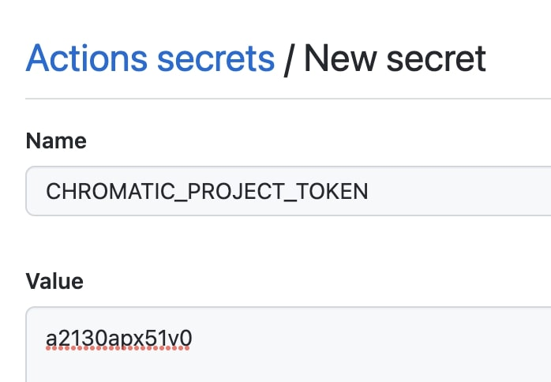

# Storypal

## Storybook + Drupal = Story-Pal 🤩

### What is Storybook?


[Storybook is a design-guide tool, for managing UI components, page-layouts in isolation.](https://storybook.js.org/)

It's following the 'atomic design' theory - building components up, which can work in isolation, and be put together to create larger components.

### What is Storypal?

This is an example of a custom Drupal theme, where Drupal and Storybook share the same assets:
Twig, Javascript, CSS (SCSS) etc.

[The Storybook setup is loosely based on this excellent article on Medium](https://medium.com/@askibinski/integrating-storybook-with-drupal-ddabfc6c2f9d) by [Albert Skibinski](https://medium.com/@askibinski)

You can get this up and running locally by running:

```bash
npm install

npm run start
```

Now your Storybook and assets builder/watcher should be running.

I'm personally using `node v15.5.0` and `npm v6.14.10` at the time of writing, but I'm sure it works with older versions too.

Notice: If you're using a different version, you should update the chromatic.yml GitHub action.

### Chromatic + GitHub actions
#### Storybook hosting + automatic visual tests

This repo includes a GitHub actions workflow for getting Chromatic deploys up and running.

The only thing you need to do is:

- Go to https://www.chromatic.com/ and create an account
- (optional) Link your GitHub to your Chromatic account for cooler PR tests
- Create a Chromatic project, and note your token
- Insert your token as a repo secret on GitHub as "CHROMATIC_PROJECT_TOKEN":

https://github.com/[REPO_HOST]/[REPO_NAME]/settings/secrets/actions



Now, when you create a pull-request, or merge to `main`, your Storybook will be hosted in Chromatic - and it will run automatic UI (visual) tests.
